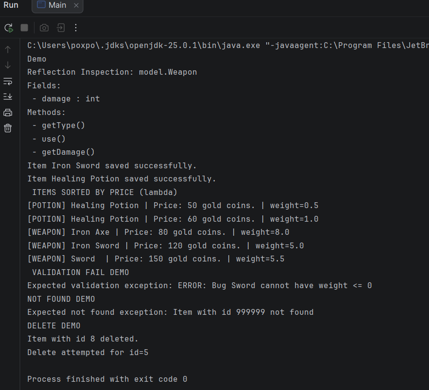
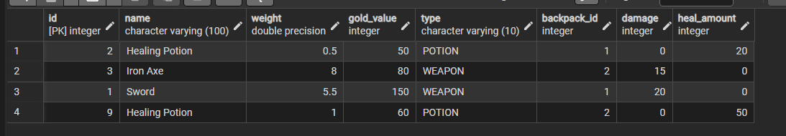
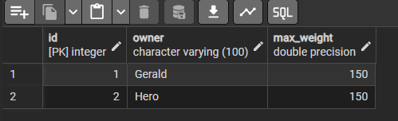

## 1. Project Overview
A Java-based application to manage RPG game inventories using **JDBC** and **PostgreSQL**. It demonstrates **CRUD operations**, **OOP principles**, and **Exception Handling**.

---

## 2. OOP Design
* **Inheritance:** `GameItem` (Abstract Base Class) is extended by `Weapon` and `Potion`.
* **Interfaces:** Implemented `Sellable` (for price) and `Usable` (for item action).
* **Polymorphism:** The system handles different item types uniformly in the Service layer.
* **Encapsulation:** All fields are `private` with public Getters/Setters.
* **Composition:** `Backpack` entity contains a collection of Items (One-to-Many relation).

---

## 3. Database Schema
The database consists of two tables linked by a **Foreign Key**:
1.  **`backpacks`**: Stores owners (`id`, `owner_name`, `max_weight`).
2.  **`items`**: Stores game items (`id`, `name`, `type`, `backpack_id` FK).

sql
-- Sample Insert
INSERT INTO backpacks (owner_name, max_weight) VALUES ('Dragonborn', 150);
INSERT INTO items (name, type, backpack_id) VALUES ('Steel Sword', 'WEAPON', 1);
## 4. Features & Architecture   

* **CRUD:** Create, Read (Find by ID), Update (Modify stats), Delete.
* **Validation:** Business logic prevents negative weight/price.
* **Exception Handling:** Custom `InvalidItemException` is thrown and caught for invalid inputs.

---
## 5. SOLID Architecture (Layers)

Controller: delegates requests to the service (no business logic)

Service: validation + business rules + throws custom exceptions

Repository: JDBC CRUD only (no business logic)

Database: PostgreSQL tables with FK relationship

---
## SOLID Principles
SRP (Single Responsibility)

InventoryController only delegates

InventoryService validates input and applies rules

ItemRepository only executes SQL (CRUD)

SortingUtils only sorts lists

ReflectionUtil only inspects classes at runtime
## OCP (Open–Closed)

Domain model is open for extension: new item types can be added by creating new subclasses of GameItem without modifying existing model classes.

Current persistence limitation: repository mapping is currently implemented for WEAPON and POTION using the type column, so adding a new item type would require extending the repository mapping logic.
(Future improvement: use a more generic mapping strategy such as a properties table or reflection-based persistence.)

## LSP (Liskov Substitution)

Weapon and Potion can be used wherever GameItem is expected, and overridden methods behave correctly.

## ISP (Interface Segregation)

Small, focused interfaces:

Usable (use())

Sellable (pricing)

IGenericRepository<T> (generic CRUD)

IInventoryService (service operations)

## DIP (Dependency Inversion)

Controller depends on IInventoryService

Service depends on IGenericRepository<GameItem>

Dependencies are passed via constructors

## 6. How to Run
1.  **Database:** Create a PostgreSQL database named `gameinventory`.
2.  **Config:** Update `src/utils/DatabaseConnection.java` with your credentials (`user`, `password`).
3.  **Run:** Execute the `Main.java` file.
4.  **Test:** The console will display the results of CRUD operations and Validation tests.

---

## 7. Reflection

**What I learned:**

How to separate responsibilities using controller/service/repository layers

How SOLID improves maintainability and testing

How to use generics to design reusable repository interfaces

How lambdas and reflection can improve flexibility and tooling

**Challenges:**

Designing clean separation between business logic and persistence logic

Mapping subclass-specific fields from database to correct subclass objects

Value of SOLID:
Clear structure, easier debugging, and easier extension of the system.
---
## DEMO

---
## database schema
**CREATE TABLE backpacks (
id SERIAL PRIMARY KEY,
owner varchar(100) NOT NULL,
max_weight FLOAT NOT NULL CHECK (max_weight > 0)
);**

**CREATE TABLE items (
id SERIAL PRIMARY KEY,
name VARCHAR(100) NOT NULL CHECK (name <> ''),
weight FLOAT NOT NULL CHECK (weight > 0),
gold_value INT NOT NULL DEFAULT 0 CHECK (gold_value >= 0),
type VARCHAR(10) NOT NULL CHECK (type IN ('WEAPON','POTION')),
backpack_id INT NOT NULL,
damage INT DEFAULT 0 CHECK (damage >= 0),
heal_amount INT DEFAULT 0 CHECK (heal_amount >= 0),
FOREIGN KEY (backpack_id) REFERENCES backpacks(id) ON DELETE RESTRICT
);**

## Items

## Backpacks
